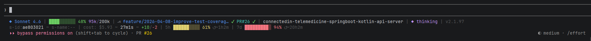

# Claude Code Statusline v2

A multi-line, adaptive-width status line for Claude Code with configurable elements, clickable GitHub links, and color-coded progress bars.



## What You Get

- **3 display modes**: 1-line (compact), 2-line, or 3-line (default)
- **Adaptive width**: Gracefully degrades across 4 terminal width tiers
- **Color-coded progress bars**: Context window + rate limits (green/yellow/red)
- **Model-colored names**: Amber (Opus), Blue (Sonnet), Cyan (Haiku)
- **Clickable links**: Branch -> GitHub, PR -> PR page, Folder -> full path
- **Git status**: Branch, clean/dirty, ahead/behind, PR number + merge status
- **Session info**: Cost, duration, lines changed, rate limits, worktree
- **Thinking / Effort / Output style**: Live indicators for Claude's current mode
- **Cross-platform**: Works on Linux, macOS, WSL, and Windows (Git Bash)
- **Pure bash + jq**: No additional dependencies

## Quick Install

### Setup via Claude Code (Recommended)

Paste this prompt into Claude Code:

```
Please check https://github.com/phorvicheka/claude-code-statusline, read the README.md, and follow the install steps. Detect whether I'm on WSL, native Linux/macOS, or Windows (Git Bash) and adjust paths accordingly.
```

> **Already have the repo locally?** You can use this shorter prompt instead:
> `Please read the README.md in this directory and follow the install steps.`

### Script Install

```bash
cd /path/to/statusline-package
bash install.sh
```

The installer will:
1. Check dependencies (bash 4+, jq, git; warns if gh is missing)
2. Ask you to choose a line count (1, 2, or 3 -- default: 3)
3. Back up any existing statusline.sh
4. Install the script to `~/.claude/statusline.sh`
5. Configure `~/.claude/settings.json`

### Manual Install

```bash
# 1. Copy the script (from the project directory)
cp statusline.sh ~/.claude/statusline.sh
chmod +x ~/.claude/statusline.sh

# 2. Configure settings.json
# Add or merge into ~/.claude/settings.json:
# {
#   "statusLine": {
#     "type": "command",
#     "command": "bash ~/.claude/statusline.sh"
#   }
# }

# 3. Start a new Claude Code session
```

### Requirements

- **bash** 4.0+
- **jq** (JSON processor)
- **git** (for branch info)
- **gh** (GitHub CLI, optional -- for PR# display)

### Platform Notes

| Platform | Status | Notes |
|----------|--------|-------|
| Linux | Full support | Native environment |
| macOS | Full support | BSD `date`/`stat` fallbacks included |
| WSL (Ubuntu) | Full support | Handles Windows backslash paths (`C:\Users\...`) sent by Claude Code |
| Windows (Git Bash / MSYS2) | Full support | GNU coreutils bundled with Git for Windows |

Claude Code may send working directory paths with backslashes on Windows. The statusline normalizes all path separators automatically — folder names, git operations, and settings lookups all work regardless of separator style.

## Configuration

### Line Count

```bash
STATUSLINE_LINES="${STATUSLINE_LINES:-3}"  # 1, 2, or 3
```

Edit at the top of `~/.claude/statusline.sh`, or override at runtime:

```bash
STATUSLINE_LINES=2 claude
```

Or set permanently in `~/.claude/settings.json`:

```json
{
  "statusLine": {
    "type": "command",
    "command": "STATUSLINE_LINES=2 bash ~/.claude/statusline.sh"
  }
}
```

### Feature Toggles

Edit the top of `~/.claude/statusline.sh`. Set any to `false` to hide:

```bash
SHOW_MODEL=true
SHOW_TOKENS=true
SHOW_GIT=true
SHOW_FOLDER=true
SHOW_THINKING=true      # thinking + effort combined block
SHOW_EFFORT=true        # part of thinking+effort block
SHOW_OUTPUT_STYLE=true
SHOW_AGENT=true
SHOW_VIM_MODE=true
SHOW_VERSION=true
SHOW_SESSION_ID=true
SHOW_SESSION_NAME=true
SHOW_COST_GROUP=true
SHOW_RATE_LIMITS=true
SHOW_WORKTREE=true
SHOW_PR=true
SHOW_CLICKABLE_LINKS=true
```

### Advanced Configuration

#### Line Layouts

Elements are grouped by line in arrays at the bottom of the script:

```bash
L1=(render_model render_tokens render_git render_folder render_thinking_effort render_output_style render_agent render_vim render_version)
L2=(render_session_ids render_cost_group render_rate_5h render_rate_7d)
L3=(render_worktree)
```

- **L1**: Identity + context (what you're working on)
- **L2**: Session metadata (cost, limits, IDs)
- **L3**: Worktree details (3-line mode only)

#### Sizing

```bash
GIT_CACHE_TTL=5         # seconds to cache git status
MAX_BRANCH_LEN=40       # max branch name length
TOKEN_BAR_WIDTH=10      # context bar character width
RATE_BAR_WIDTH=10       # rate limit bar character width
THRESHOLD_GREEN=50      # below = green
THRESHOLD_YELLOW=75     # below = yellow, above = red
```

#### Width Tiers

| Tier | Width | Effect |
|------|-------|--------|
| full | >=140 chars | All elements, full labels, max bar widths |
| wide | 100-139 | Smaller bars, branch max 30 chars |
| compact | 76-99 | Compact bars, branch max 20 chars |
| narrow | <76 | Forces single line, branch max 12 chars |

Override: `TERM_WIDTH=150 claude`

## Known Limitations

### Clickable Links

Claude Code has a [known bug](https://github.com/anthropics/claude-code/issues/26356) where the Ink renderer strips OSC 8 hyperlink escape sequences. Links work in IDE terminals (VS Code, Cursor) since v2.1.42, but are stripped in standalone terminal mode.

The escape sequences in this statusline are correct per spec. Once Anthropic fixes the Ink renderer, clickable links will work automatically without changes to this script.

**Supported terminals**: iTerm2, Kitty, WezTerm, Windows Terminal, VS Code terminal
**Not supported**: WSL default console, plain xterm, SSH sessions
**Auto-detection**: Links are automatically disabled on unsupported terminals.
**Force enable**: `FORCE_HYPERLINK=1 claude`
**Click**: Cmd+click (macOS) or Ctrl+click (Linux/Windows)

References: [Issue #26356](https://github.com/anthropics/claude-code/issues/26356), [Issue #21586](https://github.com/anthropics/claude-code/issues/21586), [OSC 8 spec](https://gist.github.com/egmontkob/eb114294efbcd5adb1944c9f3cb5feda)

### Rate Limit Data Freshness

Rate limit values (5h/7d) update only after each Claude assistant response, not in real-time. They may appear stale when idle. This is a Claude Code platform limitation, not a bug in this statusline.

See [docs/rate-limit-staleness.md](docs/rate-limit-staleness.md) for details.

## Statusline Anatomy

### Display Modes

**1-line** (`STATUSLINE_LINES=1`):
```
◆ Opus 4.6 | ████░░░░░░ 48% 96k/1m | ⎇ main ✔  ~ PR #42 ✔ | myapp | 🧠  ◆ thinking ~ ◕ high | 🔎  explanatory | vim:N | v2.1.97 | s-id:abc123de | cost: $1.23 ~ 12m34s ~ +42/-8
```

**2-line** (`STATUSLINE_LINES=2`):
```
◆ Opus 4.6 | ████░░░░░░ 48% 96k/1m | ⎇ main 🛠️  ↑2↓1  ~ PR #42 ✔ | myapp | 🧠  ◇ thinking ~ ◎ auto | ⚙️  default | agent:review | vim:N | v2.1.97
s-id:abc123de ~ s-name:my-session | cost: $1.23 ~ 12m34s ~ +42/-8 | 5h ███░░░░░░░ 38% ↺~2h14m | 7d █░░░░░░░░░ 18% ↺~4d
```

**3-line** (`STATUSLINE_LINES=3`, default):
```
◆ Opus 4.6 | ████░░░░░░ 48% 96k/1m | ⎇ main 🛠️  ↑2↓1  ~ PR #42 ✔ | myapp | 🧠  ◆ thinking ~ ◕ high | 🎓  learning | agent:review | vim:N | v2.1.97
s-id:abc123de ~ s-name:my-session | cost: $1.23 ~ 12m34s ~ +42/-8 | 5h ███░░░░░░░ 38% ↺~2h14m | 7d █░░░░░░░░░ 18% ↺~4d
wt: name:feat-auth - path:~/.claude/worktrees/feat-auth - branch:worktree-feat-auth
```

**Fresh session** (minimal data):
```
◆ Opus 4.6 | ░░░░░░░░░░ 0% 0/1.0m | ⎇ feature/my-branch 🛠️ | myapp | 🧠  ◇ thinking ~ ◎ auto | ⚙️  default | v2.1.97
s-id:536ea9b1 ~ s-name:-- | cost: -- ~ 1s ~ -- | 5h -- | 7d --
```

**High usage**:
```
◆ Opus 4.6 | ████░░░░░░ 40% 395k/1.0m ⚠ | ⎇ main ✔ | myapp | 🧠  ◆ thinking ~ ● max | ⚙️  default | v2.1.97
s-id:1a0230da ~ s-name:improve-coverage | cost: $134.00 ~ 20h35m ~ +8477/-583 | 5h ██░░░░░░░░ 25% ↺~2h54m | 7d █████████░ 91% ↺~21h54m
```

### Elements Reference

#### L1: Identity & Context

| Element | Example | Meaning | Color | Toggle |
|---------|---------|---------|-------|--------|
| Model | `◆ Opus 4.6` | Current Claude model | amber=Opus, blue=Sonnet, cyan=Haiku | `SHOW_MODEL` |
| Context bar | `████░░░░░░ 48%` | Context window used | green <50%, yellow 50-74%, red >=75% | `SHOW_TOKENS` |
| Token counts | `395k/1.0m` | Used / max tokens | white / dim | `SHOW_TOKENS` |
| Context warning | `⚠` | Exceeds 200k tokens | red | `SHOW_TOKENS` |
| Git branch | `⎇ feature/auth` | Current branch (clickable) | blue | `SHOW_GIT` |
| Git status | `✔` / `🛠️` | Clean / dirty working tree | green / yellow | `SHOW_GIT` |
| Ahead/Behind | `↑2` `↓1` | Commits ahead/behind upstream | green / red | `SHOW_GIT` |
| PR | `PR #42 ✔` | PR number + merge status (clickable) | dim + yellow | `SHOW_PR` |
| Folder | `myapp` | Workspace basename (clickable) | white | `SHOW_FOLDER` |
| Thinking + Effort | `🧠  ◆ thinking ~ ◕ high` | Thinking state + effort level | see below | `SHOW_THINKING` / `SHOW_EFFORT` |
| Output style | `🔎  explanatory` | Active output style | dim (default) / white | `SHOW_OUTPUT_STYLE` |
| Agent | `agent:review` | Active agent name | dim + magenta | `SHOW_AGENT` |
| Vim mode | `vim:N` | Current vim mode | green=N, yellow=I | `SHOW_VIM_MODE` |
| Version | `v2.1.97` | Claude Code version | dim | `SHOW_VERSION` |

#### L2: Session Metadata

| Element | Example | Meaning | Toggle |
|---------|---------|---------|--------|
| Session ID | `s-id:536ea9b1` | First 8 chars of session ID | `SHOW_SESSION_ID` |
| Session name | `s-name:my-session` | Custom name (`--` if unset) | `SHOW_SESSION_NAME` |
| Cost | `$1.23` | Session cost (`--` if $0) | `SHOW_COST_GROUP` |
| Duration | `12m34s` | Wall-clock time | `SHOW_COST_GROUP` |
| Lines changed | `+42/-8` | Added (green) / removed (red) | `SHOW_COST_GROUP` |
| 5h rate limit | `5h ███░░░ 38% ↺~2h14m` | 5-hour usage + reset countdown | `SHOW_RATE_LIMITS` |
| 7d rate limit | `7d █░░░░ 18% ↺~4d` | 7-day usage + reset countdown | `SHOW_RATE_LIMITS` |

#### L3: Worktree (3-line mode only)

| Element | Example | Toggle |
|---------|---------|--------|
| Worktree name | `wt: name:feat-auth` | `SHOW_WORKTREE` |
| Worktree path | `- path:/home/...` | `SHOW_WORKTREE` |
| Worktree branch | `- branch:wt-feat-auth` (clickable) | `SHOW_WORKTREE` |

### Thinking & Effort

Rendered as a combined block: `🧠  ◆ thinking ~ ◕ high`

**Thinking state** -- `◆` (on) / `◇` (off):

Read from (in priority order):
1. `is_thinking` in statusline JSON input (future Claude Code support)
2. `alwaysThinkingEnabled` in `.claude/settings.local.json` (project)
3. `alwaysThinkingEnabled` in `~/.claude/settings.local.json` (global)
4. `alwaysThinkingEnabled` in `.claude/settings.json` (project)
5. `alwaysThinkingEnabled` in `~/.claude/settings.json` (global)

> **Note:** `meta+t` toggles thinking in-memory only (not written to disk). Use `/config` to toggle persistently.

**Effort level** -- read from (in priority order):
1. `effort_level` / `effortLevel` / `effort` in statusline JSON (future-proof: not yet in schema)
2. Transcript JSONL -- scans backward for the most recent `/effort` command output (catches session-only levels like `max`)
3. `effortLevel` key in settings JSON (written by `/effort` for persistable levels)
4. `CLAUDE_CODE_EFFORT_LEVEL` environment variable (runtime)
5. `env.CLAUDE_CODE_EFFORT_LEVEL` in settings JSON `env` blocks

| Value | Icon | Note |
|-------|------|------|
| absent / `auto` | `◎` | Default -- Claude chooses (equivalent to `high`) |
| `low` | `◔` | Quick, minimal overhead |
| `medium` | `◑` | Balanced |
| `high` | `◕` | Thorough |
| `max` | `●` | Maximum effort (session-only -- not written to settings.json) |

Set via `/effort <level>` or `/config`. Setting to `auto` removes the key from settings entirely.

> **Note:** `/effort max` is session-only and does not persist to `settings.json`. The statusline detects it by parsing the transcript JSONL file. Avoid setting `CLAUDE_CODE_EFFORT_LEVEL` in `settings.json` `env` block — it overrides `/effort` at runtime.

### Output Style

Reads from `output_style.name` in statusline JSON, falling back to `outputStyle` in `settings.local.json`.

| Style | Icon | Set via |
|-------|------|---------|
| `default` | `⚙️` | `/config` or absent |
| `explanatory` | `🔎` | `/config` |
| `learning` | `🎓` | `/config` |

### Separators & Placeholders

| Symbol | Usage |
|--------|-------|
| `\|` | Between element groups |
| `~` | Between related items within a group |
| `--` | Data not yet available (e.g., fresh session) |

### Progress Bar Colors

All bars (context, 5h, 7d) use the same thresholds:

| Range | Color | Meaning |
|-------|-------|---------|
| 0-49% | Green | Safe |
| 50-74% | Yellow | Moderate usage |
| 75-100% | Red | High usage |

## Troubleshooting

| Issue | Solution |
|-------|----------|
| Statusline not showing | Check `settings.json` has `statusLine` config. Start a new session. |
| Folder shows raw path instead of name | Fixed in v2. The statusline normalizes Windows backslash paths (`C:\Users\...`) automatically. Update to the latest version. |
| Rate limit reset time not showing | Fixed in v2. Reset times (`↺~2h14m`) now parse both ISO 8601 strings and unix timestamps. Update to the latest version. |
| Rate limits show `--` | Rate limit data arrives after first API response. Shows `--` until then. Requires Pro/Max. |
| Rate limits seem stale | Values update only after each assistant response. See [docs/rate-limit-staleness.md](docs/rate-limit-staleness.md). |
| Unicode blocks show as boxes | Set `LANG=en_US.UTF-8` in your terminal. |
| Branch link not clickable | Auto-disabled on unsupported terminals. Use Windows Terminal or `FORCE_HYPERLINK=1 claude`. |
| Git info stale | Decrease `GIT_CACHE_TTL` or `rm -rf /tmp/claude-statusline/` |
| Width detection wrong | Override: `TERM_WIDTH=<cols>` in settings.json command. |
| PR# not showing | Requires `gh` CLI installed and authenticated. Hidden when no PR exists for branch. |
| Thinking not updating on `meta+t` | In-memory only -- not written to disk. Use `/config` to toggle persistently. |
| Effort level not showing | Set via `/effort <level>` or `/config`. `auto` removes the key (shows `◎ auto`). `max` requires transcript parsing (needs `transcript_path` in JSON). |
| Effort level stuck | Remove `CLAUDE_CODE_EFFORT_LEVEL` from `settings.json` `env` block — it overrides `/effort`. |
| Output style not showing | Reads from JSON input. Ensure Claude Code v2.1+ and start a fresh session. |
| Something else looks wrong | Set `STATUSLINE_DEBUG=1` in your env to log raw JSON to `~/.claude/statusline-debug.log`, then inspect the payload. |

## Uninstall

```bash
bash uninstall.sh
```

## Debugging

Set `STATUSLINE_DEBUG=1` to log the raw JSON that Claude Code sends to `~/.claude/statusline-debug.log`:

```json
{
  "statusLine": {
    "type": "command",
    "command": "STATUSLINE_DEBUG=1 bash ~/.claude/statusline.sh"
  }
}
```

Or enable it for a single session: `STATUSLINE_DEBUG=1 claude`

The log appends each payload separated by `---`. Useful for diagnosing missing fields, unexpected formats, or path issues.

## Adding New Elements

1. Add a `SHOW_*` toggle in the Configuration section
2. Parse the JSON field in the single-jq block
3. Write a `render_*()` function (check `SHOW_*` flag, check data, print or return empty)
4. Add `render_*` to the `L1`/`L2`/`L3` arrays

## References

- [Claude Code Statusline Documentation](https://code.claude.com/docs/en/statusline)
- [isaacaudet/claude-code-statusline](https://github.com/isaacaudet/claude-code-statusline)
- [sirmalloc/ccstatusline](https://github.com/sirmalloc/ccstatusline)
