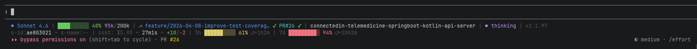

# Claude Code Statusline v2

A multi-line, adaptive-width status line for Claude Code with configurable elements, clickable GitHub links, and color-coded progress bars.



## What You Get

- **3 display modes**: 1-line (compact), 2-line, or 3-line (default; grows to 4 rows inside a git worktree; version shown next to model on all modes)
- **Adaptive width**: Gracefully degrades across 4 terminal width tiers
- **Color-coded progress bars**: Context window + rate limits (green/yellow/red)
- **Model-colored names**: Amber (Opus), Blue (Sonnet), Cyan (Haiku)
- **Clickable links**: Branch -> GitHub, PR -> PR page, Folder -> full path
- **Git status**: Branch, clean/dirty, ahead/behind, PR/MR number + review state (taken from Claude Code's own JSON: no `gh` CLI, no network)
- **Session info**: Cost, duration, lines changed, rate limits, worktree, prompt-cache warm/cold + TTL, gateway spend limit, fast-mode ⚡ badge
- **Settings group** (`settings:`): Thinking, effort, and advisor grouped on L3 in 3-line mode
- **Output group** (`output:`): Output style and caveman mode grouped on L3 in 3-line mode
- **Cross-platform**: Works on Linux, macOS, WSL, and Windows (Git Bash)
- **Pure bash + jq**: No additional dependencies
- **Tested**: `bash tests/run.sh` feeds crafted payloads (xhigh effort, Haiku, legacy shapes, hostile values, worktrees, widths) through the script

## Quick Install

### Setup via Claude Code (Recommended)

**Install or update** -- paste this prompt into Claude Code:

```
Please check https://github.com/phorvicheka/claude-code-statusline, read the README.md, and follow the install steps.
```

> **Already have the repo locally?** Use:
> `Please read the README.md in this directory and follow the install steps.`

**Customize elements** -- toggle visibility of any statusline element:

```
In my Claude Code statusline at ~/.claude/statusline.sh, set SHOW_<ELEMENT>=false for: <elements to hide>. Leave all others as true. The toggle flags are at the top of the file.
```

> Example: `...set SHOW_COST_GROUP=false and SHOW_OUTPUT_STYLE=false for: cost group, output style...`
>
> Available elements: `MODEL`, `TOKENS`, `GIT`, `FOLDER`, `THINKING`, `EFFORT`, `OUTPUT_STYLE`, `CAVEMAN`, `AGENT`, `ADVISOR`, `VIM_MODE`, `VERSION`, `SESSION_ID`, `SESSION_NAME`, `COST_GROUP`, `RATE_LIMITS`, `WORKTREE`, `PR`, `FAST`, `CACHE`, `SPEND`, `CWD_PATH`, `CLICKABLE_LINKS`

**Uninstall**:

```
Please check https://github.com/phorvicheka/claude-code-statusline, read the README.md, and run the uninstall steps.
```

> **Already have the repo locally?** Use:
> `Please run bash uninstall.sh in this directory to remove the statusline.`

### Script Install

```bash
cd /path/to/statusline-package
bash install.sh -y     # recommended: non-interactive, 3-line default, auto-update
bash install.sh        # interactive: choose line count, confirm overwrites
```

The installer will:
1. Check dependencies (bash 4+, jq, git; warns if gh is missing)
2. Back up any existing statusline.sh
3. Install or update the script to `~/.claude/statusline.sh`
4. Configure `~/.claude/settings.json`

### Manual Install

```bash
# 1. Copy the script (from the project directory)
cp statusline.sh ~/.claude/statusline.sh
chmod +x ~/.claude/statusline.sh

# 2. Configure settings.json
# Add or merge into ~/.claude/settings.json:
# {
#   "statusLine": {
#     "type": "command",
#     "command": "bash ~/.claude/statusline.sh"
#   }
# }

# 3. Start a new Claude Code session
```

### Requirements

- **bash** 4.0+
- **jq** (JSON processor)
- **git** (for branch info)
- **gh** (GitHub CLI, optional -- for PR# display)

### Platform Notes

| Platform | Status | Notes |
|----------|--------|-------|
| Linux | Full support | Native environment |
| macOS | Full support | BSD `date`/`stat` fallbacks included |
| WSL (Ubuntu) | Full support | Handles Windows backslash paths (`C:\Users\...`) sent by Claude Code |
| Windows (Git Bash / MSYS2) | Full support | GNU coreutils bundled; `stty size` may fail (defaults to 80 cols / compact tier) |

Claude Code may send working directory paths with backslashes on Windows. The statusline normalizes all path separators automatically -- folder names, git operations, and settings lookups all work regardless of separator style.

> **Tip: multiple package managers on WSL/Windows.** If you installed Claude Code with both npm and pnpm (or yarn), your shell may resolve `claude` to the older installation. Run `which claude` to see which binary is active, then update with that package manager. The statusline's version display reflects whatever binary is running -- if it looks outdated, this is likely why.

## Configuration

See [Configuration Guide](docs/configuration.md) for line count, feature toggles, sizing, and width tiers.

## Statusline Anatomy

See [Statusline Anatomy](docs/anatomy.md) for display modes, element reference, thinking/effort details, and progress bar colors.

## Performance

Render time targets **< 200ms warm**. Caches git state (30s; 300s on WSL2 `/mnt/*`), the `settings.json` parse (120s), the transcript scan for `/advisor` (incremental), and a fallback `TERM_WIDTH` probe under `/tmp/claude-statusline/`. See [docs/performance.md](docs/performance.md) for benchmarks, diagnosis, and TUI redraw stacking explained.

## Known Limitations

See [Known Limitations](docs/known-limitations.md) for clickable link support and rate limit data freshness.

## Troubleshooting

| Issue | Solution |
|-------|----------|
| Statusline not showing | Check `settings.json` has `statusLine` config. Start a new session. |
| Version shows outdated | If you installed Claude Code with multiple package managers (npm, pnpm, yarn), only one is on your `$PATH`. Update the one your shell actually resolves: run `which claude` to find it, then update with the matching package manager (e.g. `pnpm update -g @anthropic-ai/claude-code`). |
| Folder shows raw path instead of name | Fixed in v2. The statusline normalizes Windows backslash paths (`C:\Users\...`) automatically. Update to the latest version. |
| Rate limit reset time not showing | Fixed in v2. Reset times (`↺~2h14m`) now parse both ISO 8601 strings and unix timestamps. Also shown at compact width (76-99 cols) -- previously only at full/wide (>=100). On Git Bash, `stty size` may fail, defaulting to 80 cols (compact). Update to the latest version. |
| Rate limits show `--` | Rate limit data arrives after first API response. Shows `--` until then. Requires Pro/Max. |
| Rate limits seem stale | Values update only after each assistant response. See [docs/rate-limit-staleness.md](docs/rate-limit-staleness.md). |
| Unicode blocks show as boxes | Set `LANG=en_US.UTF-8` in your terminal. |
| Branch link not clickable | Auto-disabled on unsupported terminals. Use Windows Terminal or `FORCE_HYPERLINK=1 claude`. |
| Git info stale | Decrease `GIT_CACHE_TTL` (default 30s) or `rm -rf /tmp/claude-statusline/` |
| Statusline + input box duplicated above output | TUI redraw stacking when render > ~300ms. See [docs/performance.md](docs/performance.md). The script targets < 200ms warm; if yours is slower, profile with `STATUSLINE_DEBUG=1` and bump TTLs. |
| Output style / advisor setting slow to reflect | Settings preload is cached (`SETTINGS_CACHE_TTL`, default 120s). `rm -rf /tmp/claude-statusline/` to refresh. Effort and thinking are live: they come straight from Claude Code's JSON. |
| Wrong width after terminal resize | Claude Code passes the live size in `$COLUMNS`, which is used first and never cached. Only the fallback probe (builds that don't set `COLUMNS`) is cached (`WIDTH_CACHE_TTL`); `rm -rf /tmp/claude-statusline/` to refresh. |
| Branch name truncated | Width detection may fail on Git Bash (now uses `tput cols` with 120-col default). Update to latest, or override: `TERM_WIDTH=<cols>` in settings.json command. |
| Width detection wrong | Override: `TERM_WIDTH=<cols>` in settings.json command. |
| PR# not showing | Comes from Claude Code's `pr.*` JSON (shown only while an open PR/MR exists for the branch; GitLab MRs need Claude Code >= 2.1.234). The `gh` CLI is no longer used. |
| Thinking not updating on `meta+t` | In-memory only -- not written to disk. Use `/config` to toggle persistently. |
| Effort level not showing | Effort is read from `effort.level` in Claude Code's JSON, which is absent when the active model has no effort parameter (e.g. Haiku), so the statusline then shows no effort on purpose. For other models set it with `/effort <level>`: `low`, `medium`, `high`, `xhigh`, `max`. |
| Effort level stuck | `CLAUDE_CODE_EFFORT_LEVEL` (env or `settings.json` `env` block) overrides `/effort` inside Claude Code itself; remove it. The statusline just mirrors what Claude Code reports. |
| Output style not showing | Reads from JSON input. Ensure Claude Code v2.1+ and start a fresh session. |
| Something else looks wrong | Set `STATUSLINE_DEBUG=1` in your env to log raw JSON to `~/.claude/statusline-debug.log`. See [Debugging Guide](docs/debugging.md). |

## Changelog

See [CHANGELOG.md](CHANGELOG.md).

## Uninstall

```bash
bash uninstall.sh
```

## Contributing

See [Contributing: Adding New Elements](docs/contributing.md). Run `bash tests/run.sh` before committing.

## References

- [Claude Code Statusline Documentation](https://code.claude.com/docs/en/statusline)
- [isaacaudet/claude-code-statusline](https://github.com/isaacaudet/claude-code-statusline)
- [sirmalloc/ccstatusline](https://github.com/sirmalloc/ccstatusline)
